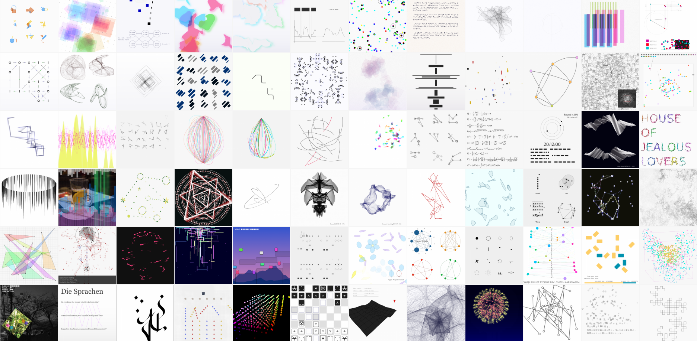
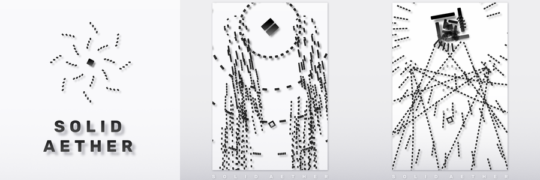

# p5.js でゲーム制作

---

## このサイトについて

このサイトは、2020年2月1日の [Processing Community Day Tokyo](https://pcd-tokyo.github.io/) にて実施したワークショップ「p5.js でゲーム制作」に向けて作成した資料を、独習できるように修正して公開したものです。

### 資料の読み方

- 画面左側に見えるのは、全体の目次です。
- 画面右側に見えるのは、今見ているページの目次です。
- **「補足」**…… 主に初心者さん向けの補足です。
- **「余談」**…… 発展的な内容、もしくは細かいことが気になる人向けの補足です。

## 内容について

### 概要

[p5.js](https://p5js.org/) を使ったミニゲーム作りを体験します。  
何もないところから始め、ちょっとずつコードを書き足していき、  
最終的にはあなただけのオリジナルのゲームが作れるようになることでしょう。

いろんなゲームに共通するプログラムの作り方を知ることで、ゲームに限らず、  
プログラミングによる創作活動に広く役立てられるような内容にできればと思います。

### 事前知識

以下をおさえておいていただけるとスムーズです。

- プログラミングの初歩（変数、関数、配列、if、for など）
- [Processing](https://processing.org/) または [p5.js](https://p5js.org/) の基本（setup/draw、図形の描画、色の指定など）
- Processing (Java) しかやったことない場合、p5.js での書き方の違いについて  
（変数や関数の宣言、型を書かない、など）

---

## 著者について

**FAL**　―　インディーゲーム開発者／クリエイティブコーダー

ゲームを作ったり、Processing や p5.js でスケッチを作ったりしています。

- Webサイト: [https://www.fal-works.com/](https://www.fal-works.com/)
- Twitter: [@falworks_ja](https://twitter.com/falworks_ja)
- OpenProcessing: [user/67512](https://www.openprocessing.org/user/67512/)
- メール: contact[ at ]fal-works.com

※ Solid Aether は Processing 製ではありません、コードが2～3万行あるので……
