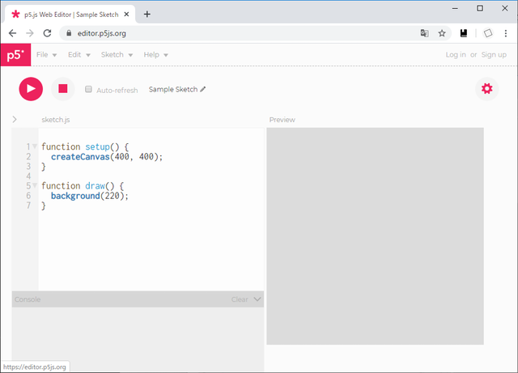

# 準備

開発・実行環境を準備します。


## 公式のエディタ

[p5.js Web Editor](https://editor.p5js.org/) で、コードを書いて即実行できます。

[](https://editor.p5js.org/)

ユーザーアカウントを登録すれば、スケッチの保存・共有も行えます。  
```https://editor.p5js.org/(ユーザー名)/sketches``` で他のユーザーのスケッチも参照可能。


## 他のオンラインエディタ

p5.js Web Editor では画面が2分割されています。  
境界線はドラッグで動かせますが、ノートPCとかで画面が狭いと不便かもしれません  
（[議論されている形跡](https://github.com/processing/p5.js-web-editor/issues/208)があるが2020年2月時点でどういう状態かは不明）。  

[OpenProcessing](https://www.openprocessing.org/) という選択肢もあり、こちらは編集と実行がそれぞれ全画面でできます。  
"Join" ボタンからアカウント登録して使います。



[OpenProcessing](https://www.openprocessing.org/) や [NEORT](https://neort.io/)（こちらは p5.js に限らずいろいろなデジタルアートが対象）などは、エディタ兼作品公開プラットフォームとして機能します。不特定多数の人にスケッチを見てもらいたいときは、ここで公開するのも良いでしょう。

動画を撮りたいときは、筆者の場合は [Open Broadcaster Software (OBS)](https://obsproject.com/ja) を使っています。  
（ブラウザのハードウェアアクセラレーションを切らないと撮れなかったりする？ かもしれないのですがちょっと筆者もまだ詳しくありません）




ローカルで使うための強力なエディタとしては、例えば [Visual Studio Code](https://azure.microsoft.com/ja-jp/products/visual-studio-code/) などがあります。  
参考： [PCD2019の田所先生のワークショップ資料](https://yoppa.org/pcd19)

ローカルで編集する場合、ソースコードは *.js ファイルとして保存し、別に用意した html ファイルでそれを呼び出すことで実行できます。

筆者の場合、ソースコードを sketch.js とし、その隣に index.html というファイルを作って、その中を以下のようにしています。  
4 行目では p5.js の本体をインターネット経由で引っ張ってきており、現行バージョンは v0.10.2 ですが、これは今後もバージョンアップしていくことが予想されます。

```html
<html>

<head>
  <script type="text/javascript" src="https://cdnjs.cloudflare.com/ajax/libs/p5.js/0.10.2/p5.min.js" defer></script>
  <script type="text/javascript" src="./sketch.js" defer></script>
</head>

<body style="margin: 0px;"></body>

</html>
```

他にもいろいろツールがあります、初めてだと使い方に戸惑うかもしれませんが。例えば……
- [ESLint](https://eslint.org/) は、推奨される書き方から外れたコードについて警告したり自動で修正したりしてくれます。  
- [Prettier](https://prettier.io/) は、スペースや改行や括弧の有無などを一定の規則で自動整形してくれます。
- ツールと呼ぶのも微妙ですが [TypeScript](https://www.typescriptlang.org/) は、JavaScript に静的型付けを導入した言語です。
- モジュールバンドラ（[webpack](https://webpack.js.org/) や [Rollup](https://rollupjs.org/) 等）は、複数のファイルに分けて書いたソースコードを統合してくれます。
- パッケージ管理ツール（[npm](https://www.npmjs.com/) や [Yarn](https://yarnpkg.com/lang/ja/)）は、以上のような各種ツールのダウンロードや実行を補佐してくれます。

なにいってだこいつ、と思った人は正常です。これがジャバスクリプトだ！  
気楽に書けるのがメリットであるはずの p5.js で、がっちり環境を整える人はあまり多くはないでしょうから、慣れてきてから調べても遅くないと思います。

