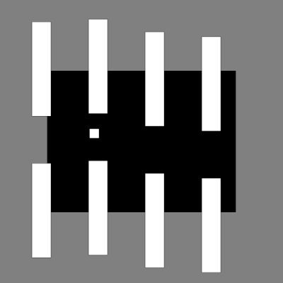

# 最初に少し考えてみる

## 前置き

ここでは、実際のコーディングに入る前に、少しだけ抽象的なことを考えてみます。

具体的なソースコードがないとイメージしにくいという人は、いったん話半分に聞いていただいても問題ありません。

## 何を考えるべきか

突き詰めて考えると、

- あらゆるゲームの キャラ／障害物／アイテム etc. は、すべて**データ**の集まり
- ゲーム画面に動きがあるということは、**データが変化している**ということ

よって、次のことがわかれば、ゲームプログラムの構成要素が分かったことになる

1. データの**種類**には、どういったものがあるのか？
1. それらのデータを使う**処理**には、どういったものがあるのか？


## データの種類を考える

### この世界に存在するものは何か？


今回、次のように呼ぶことにする

- 「プレイヤー」： 遊ぶ人が操作する対象
- 「ブロック」： 迫ってくる障害物
- 「エンティティ」： 「プレイヤー」と「ブロック」の総称

以上が今回の主役。  
まずはこれらに関係するデータについて考え、その他についてはコードを書きながらおいおい考えていくことにする


分野によってはよく使われるのですが、一般的には馴染みのない言葉です。  
直訳すると「実体」。

とはいえ、深く考えず、「なんでもいいから何か呼び方を決めておきたかったので、適当なカタカナ語を当てることにした」くらいのゆるい捉え方で大丈夫です。




名前は極めて重要である、という話はしばしば聞かれます。  
例えば：
[名前重要 | プログラマが知るべき97のこと](https://xn--97-273ae6a4irb6e2hsoiozc2g4b8082p.com/%E3%82%A8%E3%83%83%E3%82%BB%E3%82%A4/%E5%90%8D%E5%89%8D%E9%87%8D%E8%A6%81/)



一概には言えないところがあります。

例えば、初期案の見た目から「ブロック」と名付けちゃったけど、もしグラフィックを差し替えてブロック状に見えなくなったら、それはもうブロックじゃないんじゃないか？ など色々考えられます。

事前に予想できる範囲で極力適切な名前をつけるとしても、作りたいものの最終形が変化したら個々の名前も変化するのは仕方ない、と考えて都度修正していくことも必要かもしれません。




エンティティについてググると「独立した一意の対象物」みたいな定義が出てきます。  
これは何かというと、まずエンティティではない例として、たとえば次のようなコードがあり、値は絶対に変化しないものとする。

```javascript
const sizeA = { width: 100, height: 100 };
const sizeB = { width: 100, height: 100 };
```

このとき、`sizeA` も `sizeB` も指し示すものは全く同じである（区別する必要が無い）という可能性が高そうです。

逆に次のようなものを考える。

```javascript
const personA = { name: "山田太郎", residence: "神奈川県" };
const personB = { name: "山田太郎", residence: "神奈川県" }; // 別人
```

これを見ると、中身が同じでも実体としては別物と考える必要がありそうです。また逆に、仮に `personA` の人が引っ越したり改姓したりしても、その人が以前と同一人物であることに変わりはない。  
こういう、何らかのアイデンティティを持っているような存在の一つ一つのことをエンティティと呼ぶのだ、と考えて概ね間違いはないと思う。

ただ、以上はとりわけ一般的かつ大雑把な説明です。  
ゲームでエンティティと言う場合は、物理的な存在（つまり概念的な何かではなく、必ずゲーム世界の空間のどこかに位置しているような何か）だけを指すかもしれないし、あるいはそれに限らないかもしれません。

細かいことは文脈次第であり、ひとまず本ワークショップでは、ゲーム空間内を移動できるような物体、つまり少なくとも「位置」と「速度」を持つような物体のことを「エンティティ」と呼んでいます。

「エンティティ」（entity）以外の用語候補としては、「ゲームオブジェクト」（game object）や「アクター」（actor）などがありえます。



### 一つ一つのエンティティに固有のデータは何か？

どのエンティティも、画面上のどこかに位置していて、かつ移動している  
→ つまり、次のデータを持っているはず

- 位置 (x, y)
- 速度 (x, y)


「速度」の定義は「単位時間あたりの位置の変化量」です。

今回のワークショップでは、単位時間は1フレーム、つまり p5.js の `setup()`/`draw()` における `draw()` 1回分で考えます。

仮にある物体の位置の座標が画面中央の (400, 300) で、速度が (0, 1) だったとすると、
y座標が繰り返し 1 ずつ増えていくので、少しずつ下方向に動くという結果になります。

p5.js スケッチで書くと以下のとおりです。

```javascript
let x = 400; // 位置のx座標
let y = 300; // 位置のy座標
let vx = 0; // 速度のx成分
let vy = 1; // 速度のy成分

function setup() {
  createCanvas(800, 600);
}

function draw() {
  // 速度に応じて位置を変化させる
  x += vx;
  y += vy;

  // 現在の位置に丸を描く
  background(0);
  circle(x, y, 100);
}
```


なお、簡単のため、

- ブロックの「大きさ」はみんな一緒（画面からはみ出しているだけ）
- 「色」や「形」も（今のところ）みんな一緒

と考えておく。これらのデータはエンティティごとに管理しなくてもよいことになる





決してそうではありません。

例えば、

- ブロックの「速度」についても、みんな一定だし変化しないのでは
- 後々、「動かない（＝速度が不要な）エンティティ」が出てくる可能性はないか
- プレイヤーやブロックの単位でなく、エンティティでひとまとめに考えていいのか

などなどの疑問がありえます。

実際、今回の例で「インスタンスごとに最低限必要なデータ」を厳密に考えると、

- プレイヤー
    - y座標
    - y速度
- ブロック
    - x座標
    - y座標
    - x速度

みたいな感じになりそうです。

しかし今回のワークショップでは、ソースコードを他のゲームに転用していただくことをちょっとだけ意識しているので、「画面上を上下左右に動き回れる物体」を一般的なエンティティの像として考え、それをベースに話を進めています。

逆に、大きさや色なども後になって個別に持たせたくなる可能性が高そうだし、それを今から想定しておいても良いのでは？ ということも考えられます。これについては、属性を増やす分には後から都度考えればよいだろうという判断にしました。

いずれにしても、今後の拡張を考えると「正解」がはっきり定まるものではないので、今回のワークショップでは話の都合上こうなっている、くらいに捉えていただければと思います。



## データの処理を考える

エンティティの持つデータが「位置」と「速度」だとして、これらはどんなふうに処理されるのか？

列挙してみる

- プレイヤーもブロックも、「速度を適用して**位置を更新**する」という点だけは共通している
- プレイヤーとブロックで、データを**作成**する（位置や速度の初期値を決める）方法が異なる
- プレイヤーとブロックは見た目が違うので、**描画**の方法も異なる
- プレイヤーのみ、**重力で落下**したり**ジャンプ**したりする

整理すると……

### 全エンティティ共通

- 位置の更新

### プレイヤー用

- 作成
- 重力の適用
- ジャンプ
- 描画

### ブロック用

- 作成
- 描画
