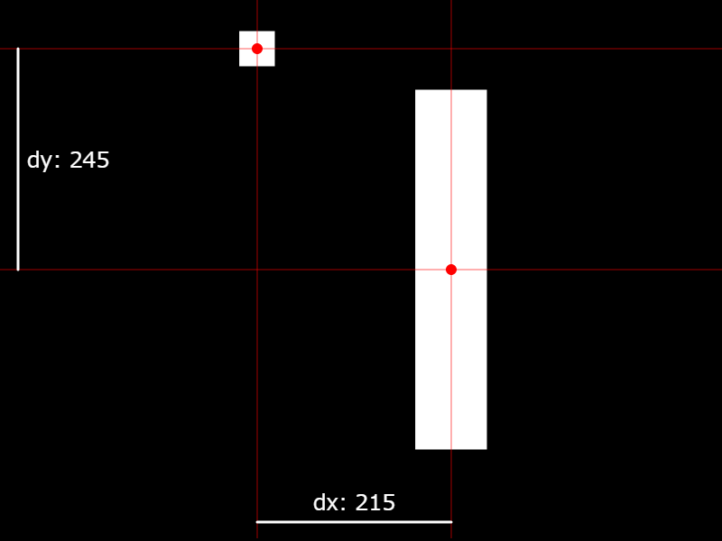

# 衝突判定を実装

## 判定方法

[説明用スケッチ](https://fal-works.github.io/make-games-with-p5js-src/07-collision/one-on-one/)
[](https://fal-works.github.io/make-games-with-p5js-src/07-collision/one-on-one/)

四角形 A と四角形 B が衝突しているかどうかを確認する方法：

1. A, B の x 軸方向での距離が十分に開いていたら、衝突していない
1. A, B の y 軸方向での距離が十分に開いていたら、衝突していない
3. x, y 両方で距離が近ければ、衝突している

これを実装すると次のようになる

```javascript
/**
 * 2つのエンティティが衝突しているかどうかをチェックする
 *
 * @param entityA 衝突しているかどうかを確認したいエンティティ
 * @param entityB 同上
 * @param collisionXDistance 衝突しないギリギリのx距離
 * @param collisionYDistance 衝突しないギリギリのy距離
 * @returns 衝突していたら `true` そうでなければ `false` を返す
 */
function entitiesAreColliding(
  entityA,
  entityB,
  collisionXDistance,
  collisionYDistance
) {
  // xとy、いずれかの距離が十分開いていたら、衝突していないので false を返す

  let currentXDistance = abs(entityA.x - entityB.x); // 現在のx距離
  if (collisionXDistance <= currentXDistance) return false;

  let currentYDistance = abs(entityA.y - entityB.y); // 現在のy距離
  if (collisionYDistance <= currentYDistance) return false;

  return true; // ここまで来たら、x方向でもy方向でも重なっているので true
}
```

ここで、「衝突しないギリギリの距離」は次の通り

- x軸方向： `(A の幅の半分) + (B の幅の半分)`
- y軸方向： `(A の高さの半分) + (B の高さの半分)`



2次元空間で2つの物体の衝突を確認する方法として、大雑把に分けると次のようなものがあります。

- 両方とも矩形（くけい）とみなし、x距離/y距離 を確認する
- 両方とも円形とみなし、中心点同士の距離を確認する
- それぞれ別個に形状の情報をもたせ、形状の組み合わせに応じて適した処理をする

※ 矩形は長方形と同じ意味。この文脈では矩形と呼ぶことの方がたぶん多い  
※ 3次元だと矩形や円の代わりに立方体や球になる

このなかで最も処理効率が良いのは、矩形同士の判定です。

例えばストⅡなどの2D格闘ゲームでも、キャラ同士の当たり判定を矩形の組み合わせで行っていたようです。  
参考： [https://game.capcom.com/cfn/sfv/column-130393.html](https://game.capcom.com/cfn/sfv/column-130393.html)



## 実装

1. 上述の衝突判定関数を用意する
1. プレイヤー 対 各ブロック について判定し、衝突していたらゲームオーバー

```javascript
// ---- エンティティ関連の関数 --------------------------------------------------

// 全エンティティ共通

function updatePosition(entity) {
  entity.x += entity.vx;
  entity.y += entity.vy;
}

// プレイヤーエンティティ用

function createPlayer() {
  return {
    x: 200,
    y: 300,
    vx: 0,
    vy: 0
  };
}

function applyGravity(entity) {
  entity.vy += 0.15;
}

function applyJump(entity) {
  entity.vy = -5;
}

function drawPlayer(entity) {
  square(entity.x, entity.y, 40);
}

function playerIsAlive(entity) {
  // プレイヤーの位置が生存圏内なら true を返す。
  // 600 は画面の下端
  return entity.y < 600;
}

// ブロックエンティティ用

function createBlock(y) {
  return {
    x: 900,
    y,
    vx: -2,
    vy: 0
  };
}

function drawBlock(entity) {
  rect(entity.x, entity.y, 80, 400);
}

function blockIsAlive(entity) {
  // ブロックの位置が生存圏内なら true を返す。
  // -100 は適当な値（ブロックが見えなくなる位置であればよい）
  return -100 < entity.x;
}

// 複数のエンティティを処理する関数

/**
 * 2つのエンティティが衝突しているかどうかをチェックする
 *
 * @param entityA 衝突しているかどうかを確認したいエンティティ
 * @param entityB 同上
 * @param collisionXDistance 衝突しないギリギリのx距離
 * @param collisionYDistance 衝突しないギリギリのy距離
 * @returns 衝突していたら `true` そうでなければ `false` を返す
 */
function entitiesAreColliding(
  entityA,
  entityB,
  collisionXDistance,
  collisionYDistance
) {
  // xとy、いずれかの距離が十分開いていたら、衝突していないので false を返す

  let currentXDistance = abs(entityA.x - entityB.x); // 現在のx距離
  if (collisionXDistance <= currentXDistance) return false;

  let currentYDistance = abs(entityA.y - entityB.y); // 現在のy距離
  if (collisionYDistance <= currentYDistance) return false;

  return true; // ここまで来たら、x方向でもy方向でも重なっているので true
}

// ---- ゲーム全体に関わる部分 --------------------------------------------

/** プレイヤーエンティティ */
let player;

/** ブロックエンティティの配列 */
let blocks;

/** ゲームの状態。"play" か "gameover" を入れるものとする */
let gameState;

/** ブロックを上下ペアで作成し、`blocks` に追加する */
function addBlockPair() {
  let y = random(-100, 100);
  blocks.push(createBlock(y)); // 上のブロック
  blocks.push(createBlock(y + 600)); // 下のブロック
}

/** ゲームオーバー画面を表示する */
function drawGameoverScreen() {
  background(0, 192); // 透明度 192 の黒
  fill(255);
  textSize(64);
  textAlign(CENTER, CENTER); // 横に中央揃え ＆ 縦にも中央揃え
  text("GAME OVER", width / 2, height / 2); // 画面中央にテキスト表示
}

/** ゲームのリセット */
function resetGame() {
  // 状態をリセット
  gameState = "play";

  // プレイヤーを作成
  player = createPlayer();

  // ブロックの配列準備
  blocks = [];
}

/** ゲームの更新 */
function updateGame() {
  // ゲームオーバーなら更新しない
  if (gameState === "gameover") return;

  // ブロックの追加と削除
  if (frameCount % 120 === 1) addBlockPair(blocks); // 一定間隔でブロック追加
  blocks = blocks.filter(blockIsAlive); // 生きているブロックだけ残す

  // 全エンティティの位置を更新
  updatePosition(player);
  for (let block of blocks) updatePosition(block);

  // プレイヤーに重力を適用
  applyGravity(player);

  // プレイヤーが死んでいたらゲームオーバー
  if (!playerIsAlive(player)) {
    gameState = "gameover";
    return;
  }

  // 衝突判定
  for (let block of blocks) {
    if (entitiesAreColliding(player, block, 20 + 40, 20 + 200)) {
      gameState = "gameover";
      break;
    }
  }
}

/** ゲームの描画 */
function drawGame() {
  // 全エンティティを描画
  background(0);
  drawPlayer(player);
  for (let block of blocks) drawBlock(block);

  // ゲームオーバー状態なら、それ用の画面を表示
  if (gameState === "gameover") drawGameoverScreen();
}

/** マウスボタンが押されたときのゲームへの影響 */
function onMousePress() {
  switch (gameState) {
    case "play":
      // プレイ中の状態ならプレイヤーをジャンプさせる
      applyJump(player);
      break;
    case "gameover":
      // ゲームオーバー状態ならリセット
      resetGame();
      break;
  }
}

// ---- setup/draw 他 ----------------------------------------------------------

function setup() {
  createCanvas(800, 600);
  rectMode(CENTER);

  resetGame();
}

function draw() {
  updateGame();
  drawGame();
}

function mousePressed() {
  onMousePress();
}
```



今回の例では総当たり的に衝突判定をしていますがこの場合、例えば物体が1000個あって相互に衝突可能だったりすると百万回弱のループが必要になり、しかもそれを継続的に繰り返さなければなりません。つまり、衝突判定は全体の中でもパフォーマンス上のボトルネックになりやすい要素の一つなのです。

そのため、無駄な判定を削減するような高度な工夫がいろいろ存在します（筆者は自力でやったことはありません）。  
参考： [JavaScriptで大量のオブジェクトの当たり判定を効率的にとる](https://sbfl.net/blog/2017/12/03/javascript-collision/)

単純な削減方法としては、2フレームに1回判定すれば十分でしょ、みたいなサボり方をするというのがあり、市販のゲームでもそうしているケースはあるようです。



- 物体の動きが速すぎると、衝突する範囲を飛び越えてすり抜けてしまう可能性があり、ちゃんとした物理エンジンはそういうのもチェックしたりするようです。
- 衝突後の処理。衝突した時点でゲームが止まったり、どちらかが消滅したりすると楽なのですが、そうでない場合は押し返したり反発したりといった処理が必要になります。特にマリオ的なのを作ろうとすると、マリオとブロックとの衝突判定で変なところに引っかかったりして意外と苦労するかもしれません。
