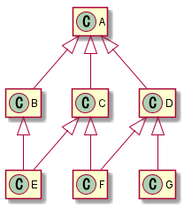

# プレイヤーだけ実装してみる

## ソースコード全体の構成を決めておく

ここからいろいろソースコードを増やしていくので、  
整理のため、ソースコード全体を以下の3つのセクションに分けることにする

1. エンティティ関連の関数
1. ゲーム全体に関わる部分
1. setup/draw 他

ついでに `rectMode()` も書いておく（後で四角形を描画するので）

```javascript { hl_lines=["0-10", 13, 15, 19, 22, "25-27"] }
// ---- エンティティ関連の関数 ---------------------------------------------

// （ここに何かが入る）

// ---- ゲーム全体に関わる部分 ---------------------------------------------

// （ここに何かが入る）

// ---- setup/draw 他 --------------------------------------------------

function setup() {
  createCanvas(800, 600);
  rectMode(CENTER); // 四角形の基準点を角から中心に変える

  // （ここに初期化処理が入る）
}

function draw() {
  // （ここにデータ操作処理が入る）

  background(0);
  // （ここに描画処理が入る）
}

function mousePressed() {
  // （ここにマウスボタンを押したときの処理が入る）
}
```

`mousePressed()` は、マウスボタンが押されたときに p5.js によって自動的に実行される  
（→ [リファレンス](https://p5js.org/reference/#/p5/mousePressed)）


プログラム全体をいくつかのまとまりに分割すると見通しが良くなりますが、このようにコメントでなんとかするというのは簡易的な方法に過ぎません。

本来だと、プログラムを機能ごとに分割（しばしば階層化を伴う）したものをそれぞれ別のファイルに分けて保存するという方法を取ることが多いです。

具体的な方法としては ES2015 の `import`/`export` を始め何種類かあって、あとモジュールバンドラで統合して云々……みたいな話があるのですが、（少なくとも筆者の感覚では）いろいろ込み入っているので、ここでは割愛します。ご興味があればゆっくり調べてみてください。



## 【再掲】エンティティ関連の処理

### 全エンティティ共通

- 位置の更新

### プレイヤー用

- 作成
- 重力の適用
- ジャンプ
- 描画

### ブロック用

- 作成
- 描画


## やること

1. プレイヤーを入れる変数を用意する
1. `setup()` の中で、プレイヤーを**作成**する
1. `draw()` の中で、プレイヤーについて以下を行う
    - **位置の更新**
    - **重力の適用**
    - **描画**
1. マウスボタンを押したときだけ、プレイヤーを**ジャンプ**させる


## 必要な関数が既に揃っている、と仮定して書いてみる

- 魔法のようにプレイヤーエンティティを作成してくれる `createPlayer()` 関数があるとする
- 魔法のようにエンティティの位置を更新してくれる `updatePosition()` 関数があるとする
- 魔法のように略

※ `createPlayer()` その他の関数は実際には存在しないので、このソースコードは動きません

```javascript { hl_lines=["7-8", "16-17", "21-27", 29, "33-34"] }
// ---- エンティティ関連の関数 ---------------------------------------------

// （ここに何かが入る）

// ---- ゲーム全体に関わる部分 ---------------------------------------------

/** プレイヤーエンティティ */
let player;

// ---- setup/draw 他 --------------------------------------------------

function setup() {
  createCanvas(800, 600);
  rectMode(CENTER);

  // プレイヤーを作成
  player = createPlayer();
}

function draw() {
  // プレイヤーの位置を更新
  updatePosition(player);

  // プレイヤーに重力を適用
  applyGravity(player);

  // プレイヤーを描画
  background(0);
  drawPlayer(player);
}

function mousePressed() {
  // プレイヤーをジャンプさせる
  applyJump(player);
}
```


これは [JSDoc](https://jsdoc.app/) という記法のコメントです。  
参考： [JSDoc - Wikipedia](https://ja.wikipedia.org/wiki/JSDoc)

p5.js Web Editor などを使っている場合、これに特別な意味は無く、`// ...` とか `/* ... */` とかで書いたときと扱いは変わりませんので、気にする必要もありません。

しかし [Visual Studio Code](https://azure.microsoft.com/ja-jp/products/visual-studio-code/) などの賢いエディタを使うと、JSDoc で書いた部分をエディタが読み取ってくれて、プログラマを補佐してくれます。たとえば今回 `let player;` の上に書いたように、ある変数宣言のすぐ上に JSDoc 記法でその変数の説明を書いたとします。他の場所でその変数を参照するとき（たとえば `player = createPlayer();` のところ）、変数名の上にマウスカーソルを重ねると、宣言時に書いたコメントをフワッと表示してくれます。変数だけでなく関数などでも同様です。

使うエディタは人によるとしても、ソースコードに説明書を埋め込む目的で、この JSDoc 記法は広く使われています。たとえば p5.js 本体のソースコードを見ると、公式のリファレンスにある説明文が、この JSDoc 形式でソースコード中に埋め込まれていることが分かります。

せっかくなのでこの資料でも、特定の関数や変数の説明を書く場合は `/** ... */` で書いています。逆に `// ...` で書いてあるコメントは、ちょっとしたメモとして付箋を貼ってあるようなイメージです。




```javascript { linenos=false }
let player;
```
で宣言だけしていて何も値を入れないのを気持ち悪いと思うかもしれません  
（いろいろバグを経験しているとそうなると思います）。

これは
```javascript { linenos=false }
let player = undefined;
```
と書くのと同じことで、この状態で `player` の何らかのプロパティ、たとえば `player.x` を参照しようとすると、
```
Uncaught TypeError: Cannot read property 'x' of undefined
```
というエラーが出ます。

これはとてもよくあるエラーで、こうならないように我々は、変数に意図せず `undefined` が入っている状況をできるだけ避けなければならない。そのためこの例を単体で見ると、宣言と同時に `createPlayer()` でデータを作って入れておくのが正解に近いです。

しかし、後々リセット処理とかを作ったりする予定なので、それに繋げやすいよう今の時点からデータの初期化を `setup()` の中でやるようにしています。という背景があるのでご了承いただければと思います。



## 必要な関数を実際に用意する

無いなら作ればよい

### 方針

プレイヤーは位置と速度を持っているので、次のようなデータがあると良さそう

```javascript { linenos=false }
// プレイヤーデータ例
let player = {
  x: 200, // 位置 x座標
  y: 300, // 位置 y座標
  vx: 0,  // 速度 x成分
  vy: 0   // 速度 y成分
};

// こうしたとき、たとえば player.x の値は 200 である
```


`x` と `y`、`vx` と `vy`、これらはそれぞれセットになって意味を持つので、それぞれをオブジェクトにまとめるべきではないか、という考え方がありえます。

たとえば

```javascript { linenos=false }
let player = {
  position: { x: 200, y: 300 },
  velocity: { x: 0, y: 0 }
};
```

もしくは、p5.js には `p5.Vector` クラスがあるのでそれを使って

```javascript { linenos=false }
let player = {
  position: createVector(200, 300),
  velocity: createVector(0, 0)
};
```

いずれも、コードと意味が合致しているし、物理をやった人ならベクトルで考えたほうが収まりが良いでしょう（ベクトルと聞いただけでウッとなる人も対象者として想定したいというのもあるのですが）。

それと、`{ x, y }` の構造を持つオブジェクトを引数に取るような関数が `position` と `velocity` の両方に使えるというのも非常に大きなメリットです。

一方で、このように構造の階層を深くすると、ただ `player` の x 座標が知りたいだけのときに `player.position.x` と書かねばならない。  
[ゲッター](https://developer.mozilla.org/ja/docs/Web/JavaScript/Reference/Functions/get) で表記を短縮できますが、内部的な処理は変わらないのと、いちいちそれやるのもな、という感じも個人的にはある。

p5.js から離れてゲームプログラミング一般の話をすると、このようにオブジェクトを入れ子状にしていく場合、深い階層の `x` とかを参照するためにちょっぴりオーバーヘッドがあります。普通は全く気にしないレベルですが、そういうデータや処理がたくさんあってものすごい回数でループしていたりすると、チリツモで遅くなることもありえます。とはいえ、そんな状況だとしたらそもそもエンティティをオブジェクトで表現すること自体どうなんだという話にもなり（参考： [データ指向設計 | Cygames Engineers' Blog](https://tech.cygames.co.jp/archives/2843/)）、どのみち p5.js で気にする話ではありません。

とりあえず今回の例ではベクトルにする利点が（いまのところ）あまり無いので、ベタっと書くほうが簡単でいいだろうということでこうしましたが、それがベストかどうかは一概には言えません。`position` と `velocity` にまとめるメリットは十分あるのでそうしても OK だと思います。


あとは、これらの位置や速度を変化させたり、位置に応じて描画したりすれば良い

なお座標 (200, 300) はこの位置


### 実装

※ 変化のないセクション（「ゲーム全体に関わる部分」、「setup/draw 他」）は省略

```javascript { hl_lines=["3-31"] }
// ---- エンティティ関連の関数 ---------------------------------------------

// 全エンティティ共通

function updatePosition(entity) {
  entity.x += entity.vx;
  entity.y += entity.vy;
}

// プレイヤーエンティティ

function createPlayer() {
  return {
    x: 200,
    y: 300,
    vx: 0,
    vy: 0
  };
}

function applyGravity(entity) {
  entity.vy += 0.15;
}

function applyJump(entity) {
  entity.vy = -5;
}

function drawPlayer(entity) {
  square(entity.x, entity.y, 40);
}
```



実行してみて、プレイヤーが

- 画面に表示されていること
- 放っておくと落下していくこと
- マウスボタンでジャンプすること

などを確認してください。




余裕があれば、各関数の中の数字部分（`200` とか `0.15` とか `-5` とか）について、いろいろ値を変えてみて、実行結果がどんなふうに変わるかを見てみてください。





```javascript
// ---- エンティティ関連の関数 ---------------------------------------------

// 全エンティティ共通

function updatePosition(entity) {
  entity.x += entity.vx;
  entity.y += entity.vy;
}

// プレイヤーエンティティ

function createPlayer() {
  return {
    x: 200,
    y: 300,
    vx: 0,
    vy: 0
  };
}

function applyGravity(entity) {
  entity.vy += 0.15;
}

function applyJump(entity) {
  entity.vy = -5;
}

function drawPlayer(entity) {
  square(entity.x, entity.y, 40);
}

// ---- ゲーム全体に関わる部分 ---------------------------------------------

/** プレイヤーエンティティ */
let player;

// ---- setup/draw 他 --------------------------------------------------

function setup() {
  createCanvas(800, 600);
  rectMode(CENTER);

  // プレイヤーを作成
  player = createPlayer();
}

function draw() {
  // プレイヤーの位置を更新
  updatePosition(player);

  // プレイヤーに重力を適用
  applyGravity(player);

  // プレイヤーを描画
  background(0);
  drawPlayer(player);
}

function mousePressed() {
  // プレイヤーをジャンプさせる
  applyJump(player);
}
```




実際には、ごく普通に

1. 関数を定義する
1. その関数を使う

という流れで書くことも多いかもしれません。

ただ、処理の具体的な中身を真っ先に書こうとすると、何度も書き直すことになったり、どこから手を付けてよいかが分かりにくくなったりする可能性が高まります（そういうところで困ったことがないのであれば、この話はあまり気にする必要はありません）。

「こういう関数があればいいのにな」という思考から出発すると、穴埋め式の問題を埋めていくような感覚で書き進めることができてスムーズなことも多いです、というのをお伝えしたかったのでした。

ちなみに筆者の場合だと

1. 関数を宣言する、ただし中身は適当なダミー
1. その関数を使う
1. ダミー部分をちゃんと実装する

という流れになることもそこそこあるように思います。  
先に宣言しておくと（エディタによっては）コード補完が使えるので。




データと振る舞いをまとめる手段として[クラス](https://developer.mozilla.org/ja/docs/Web/JavaScript/Reference/Classes)がありますね。  

迷った結果、僅差でクラスを使わない方向にしたのですが、エンティティやプレイヤーをクラスにするのも良いと思います。

## TL;DR

好きにしてくれ！

## 継承の話

クラスを知っている人向けの話をするのでクラス自体の説明は省きますが、まず継承ありだとすると、今回の例はこうでしょうか。

```javascript { linenos=false }
class Entity {
  constructor(x, y, vx, vy) {
    this.x = x;
    this.y = y;
    this.vx = vx;
    this.vy = vy;
  }

  updatePosition() {
    this.x += this.vx;
    this.y += this.vy;
  }
}

class Player extends Entity {
  constructor() {
    super(200, 300, 0, 0);
  }

  applyGravity() {
    this.vy += 0.15;
  }

  applyJump() {
    this.vy = -5;
  }

  draw() {
    square(this.x, this.y, 40);
  }
}
```

この継承というものを使うのがふさわしいケースというのは、クラスで表現している概念（ここではプレイヤーやエンティティ）の関係が綺麗にツリー状になり、その階層が深くなく（深いと理解が困難になるので）、しかもその状態が将来変化することを心配する必要がない場合に限られます。

そして、ゲームのエンティティが綺麗なツリー状になることはあまり期待しないほうが良いと思います。



もし（初学者が混乱しがちと言われる）`this` の扱いが分かっているのなら、prototype のプロパティを直接いじれば多重継承っぽいことができると思いますが、筆者はそういうことをしたことがないのでそれで問題が出ないかはよく分かりません（個人的には TypeScript で `this` の型がどうなるかを考えるとめんどくさそうな印象）。

では継承に頼らないならどうするかとすると、Java なら委譲とかコンポジションとか言うところですが、JavaScript なら普通に関数を値として持たせておくことができる。

`Player` クラスの `draw()` を例に取ると、

```javascript { linenos=false }
// 名前は適当
function drawSmallSquare(entity) {
  square(entity.x, entity.y, 40);
}

class Player extends Entity {
  constructor() {
    super(200, 300, 0, 0);
    this.drawGraphics = drawSmallSquare;
  }

  draw() {
    this.drawGraphics(this);
  }
}
```

もしくは

```javascript { linenos=false }
function drawSmallSquare(entity) {
  square(entity.x, entity.y, 40);
}

class Player extends Entity {
  constructor() {
    super(200, 300, 0, 0);

    // bind() で、drawSmallSquare() の引数 entity を this で予約した関数を作る
    this.draw = drawSmallSquare.bind(undefined, this);
  }
}
```

これで継承の問題は減ると思います。

prototype と違ってインスタンス一つ一つに関数を持たせるのは厳密には無駄なのですが、インスタンスの数とプロパティの数を掛け算したらめちゃめちゃ多くなるみたいなケースでもない限り（つまりほとんどの場合）問題ではありません。

## どっちが良いのか

ということで上記のコードが一つの選択肢になりますが、単純にデータと関数を並べて都度組み合わせる方法に比べて、このようなコードを書くメリットがどのくらいあるのか？ という話になります（特にこの資料では、読者があまり class 構文に慣れていないことを想定していて、それでもぜひ使おう！ と言うべきかどうかという話でもあります）。

### クラスのメリット

メリットはもちろんあって、まず、クラスの説明やクラスを使ったサンプルコードはネット上に溢れていて、いろいろ読み漁るときにクラスに慣れていないと厳しいというのがあります。p5.js の場合でも、公式サンプルコードのほとんどが Java ベースの Processing と互換性を持つように書かれている印象があり、つまりクラスが多用されています（古いコードは ES5 なので prototype でやってたりしますが、同じことです）。

先月（2020年1月）刊行されたばかりの書籍[『グラフィックスプログラミング入門』](https://gihyo.jp/book/2020/978-4-297-11085-7) でも、JavaScript でゲームを作るにあたって、プレイヤーキャラクターや敵キャラクターをクラスで作っていました。

それと、コードを読み書きする側のメンタルモデルと一致するかどうかという観点もあります。データと振る舞いがひとまとめになっていたほうがなんだか直感的に分かりやすい気がする、というのは確かにありえて、これもクラスベースの言語が広まっている理由の一つだと思います（といって、他のタイプの言語をそんなに知っているわけではないのですが）。

### 関数主体のメリット

他方、データと関数だけでなんとかする方法に軍配が上がる要素の一つとしては、ゲームプログラムにおいては大量の似たようなオブジェクトを配列に入れてそれをループ処理することがとても多い、という点があります。

インスタンスにメソッドが生えている形なら
```javascript { linenos=false }
for (const entity of entities) entity.updatePosition();
```
とするところ、関数主体の場合は
```javascript { linenos=false }
entities.forEach(updatePosition);
```
みたいなスマートな書き方がやりやすい。  

あと個人的なメンタルモデルとしては、エンティティの一つ一つが振る舞いを持っているというより、配列に並んだオブジェクトたちがベルトコンベア式に一つの関数に流し込まれるイメージのほうが最近はしっくりきつつあります（ベルトコンベアの比喩は Unity の ECS を説明した[この記事](http://tsubakit1.hateblo.jp/entry/2018/03/25/180203)を読んでなるほどと思ったのでした、Unity エアプですが）。

結局のところは好みの問題じゃんということになるのかもしれませんが、委譲、じゃなかった以上、ご参考までに……。
