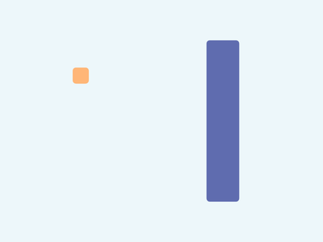
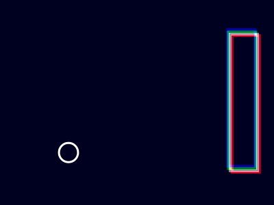

# 見た目をアレンジしてみる


無味乾燥な画面が続いたので、ここで気分転換を兼ねて……

自分の好みの雰囲気になるように、見た目をいろいろいじってみてください。



どこから手を付けていいかわからない場合、例えば……

1. まず [Color Hunt](http://www.colorhunt.co/) をざっと眺め、好みの配色を見つける
1. カラーコード（`#FFFFFF` みたいなの）を取得。  
それを使って `background()` の色を変えたり、`drawPlayer()` や `drawBlock()` の中の `fill()` の色を変えたりする（枠線を消したければ `noStroke()` も使う）

※ カラーコードは冒頭の `#` を書き忘れないように注意



色の指定方法について詳しく知りたい人は……

[p5.js の色指定](./colors) のページも確認してみてください。  
[Color Hunt](http://www.colorhunt.co/) 以外のツールも少しですが紹介しています。



なお、ここでプレイヤーやブロックの形や大きさを大幅に変更することもできます。ただしその場合、あとの方で衝突判定を実装するときに、衝突判定に使う数値の調整も合わせて必要になることを覚えておいてください。



[p5.js チートシート](https://bmoren.github.io/p5js-cheat-sheet/ja.html) や [公式リファレンス](https://p5js.org/reference/) も確認してください。

## 基本図形

### 丸
  - `circle(x, y, 大きさ)` - 円
  - `ellipse(x, y, 幅, 高さ)` - 楕円
### 四角
  - `square(x, y, 大きさ)` - 正方形
  - `rect(x, y, 幅, 高さ)` - 長方形
  - `quad(x1, y1, x2, y2, x3, y3, x4, y4)` - 任意の四角形

※ `square` の第4～7引数や `rect` の第5～8引数で、四角形の角を丸くできる
### 三角
  - `triangle(x1, y1, x2, y2, x3, y3)` - 任意の三角形

## 色や太さの指定

### 背景
  - `background(色)` - 色を指定
### 図形の輪郭
  - `stroke(色)` - 色を指定
  - `noStroke()` - 輪郭なし
  - `strokeWeight(太さ)` - 太さを指定
### 図形の塗りつぶし
  - `fill(色)` - 色を指定
  - `noFill()` - 塗りつぶしなし

## その他

### 座標変換
  - `translate(x, y)` - すべての座標の基準点を `x`, `y` だけずらす
### 回転
  - `rotate(角度)` - 現在の座標 (0, 0) を基点として回転
### push/pop
  - `push()` - 現在の 色・太さ・translate・rotate etc. を覚えておく
  - `pop()` - 前回 `push()` した時点まで戻す
### カラーモード
  - `colorMode(モード, 各引数の値の範囲)` - 色指定方法を変更
### ブレンドモード
  - `blendMode(モード)` - 例えば `ADD` で加算合成、他色々




## 例



- 色を変更
- 四角形を角丸に

```javascript { hl_lines=["30-32", "47-49", 82], linenostart=1 }
// ---- エンティティ関連の関数 ---------------------------------------------

// 全エンティティ共通

function updatePosition(entity) {
  entity.x += entity.vx;
  entity.y += entity.vy;
}

// プレイヤーエンティティ用

function createPlayer() {
  return {
    x: 200,
    y: 300,
    vx: 0,
    vy: 0
  };
}

function applyGravity(entity) {
  entity.vy += 0.15;
}

function applyJump(entity) {
  entity.vy = -5;
}

function drawPlayer(entity) {
  noStroke();
  fill("#ffb677");
  square(entity.x, entity.y, 40, 8);
}

// ブロックエンティティ用

function createBlock(y) {
  return {
    x: 900,
    y,
    vx: -2,
    vy: 0
  };
}

function drawBlock(entity) {
  noStroke();
  fill("#5f6caf");
  rect(entity.x, entity.y, 81, 400, 8);
}

// ---- ゲーム全体に関わる部分 ---------------------------------------------

/** プレイヤーエンティティ */
let player;

/** ブロックエンティティ */
let block;

// ---- setup/draw 他 --------------------------------------------------

function setup() {
  createCanvas(800, 600);
  rectMode(CENTER);

  // プレイヤーを作成
  player = createPlayer();

  // ブロックを作成
  block = createBlock(300); // とりあえず画面中央の高さで
}

function draw() {
  // 全エンティティの位置を更新
  updatePosition(player);
  updatePosition(block);

  // プレイヤーに重力を適用
  applyGravity(player);

  // 全エンティティを描画
  background("#edf7fa");
  drawPlayer(player);
  drawBlock(block);
}

function mousePressed() {
  // プレイヤーをジャンプさせる
  applyJump(player);
}
```

## 例2（おまけ）

システム変数 `frameCount` を使ったりすれば、  
エンティティごとに簡単なアニメーションも可能

三角関数（`sin()`や`cos()`）が周期関数であることを利用すると、  
たとえば次のコードで「-1 ～ 1 の間を揺れ動く数値」が得られる

```javascript { linenos=false }
sin(frameCount * 0.1) // 0.1 のところは好きに調整
```

例、めっちゃ目に悪い






```javascript
// ---- エンティティ関連の関数 ---------------------------------------------

// 全エンティティ共通

function updatePosition(entity) {
  entity.x += entity.vx;
  entity.y += entity.vy;
}

// プレイヤーエンティティ用

function createPlayer() {
  return {
    x: 200,
    y: 300,
    vx: 0,
    vy: 0
  };
}

function applyGravity(entity) {
  entity.vy += 0.15;
}

function applyJump(entity) {
  entity.vy = -5;
}

function drawPlayer(entity) {
  noFill();
  strokeWeight(6);
  stroke(255);
  let time = frameCount * 0.2;
  let transformValue = 5 * sin(time);
  let width = 56 + transformValue;
  let height = 56 - transformValue;
  ellipse(entity.x, entity.y, width, height);
}

// ブロックエンティティ用

function createBlock(y) {
  return {
    x: 900,
    y,
    vx: -2,
    vy: 0
  };
}

function drawBlock(entity) {
  push();

  translate(entity.x, entity.y);
  blendMode(ADD);
  strokeWeight(8);
  noFill();

  stroke(128);
  rect(0, 0, 80, 400);

  // noise() の扱いが雑なのと無駄が多いのとで、あまり良いコードではありません

  let x, y;
  let noiseTime = frameCount * 0.03;

  stroke(192, 0, 0);
  x = 50 * (-0.5 + noise(noiseTime));
  y = 50 * (-0.5 + noise(noiseTime + 100));
  rect(x, y, 80, 400);

  stroke(0, 128, 0);
  x = 50 * (-0.5 + noise(noiseTime + 200));
  y = 50 * (-0.5 + noise(noiseTime + 300));
  rect(x, y, 80, 400);

  stroke(0, 0, 128);
  x = 50 * (-0.5 + noise(noiseTime + 400));
  y = 50 * (-0.5 + noise(noiseTime + 500));
  rect(x, y, 80, 400);

  pop();
}

// ---- ゲーム全体に関わる部分 ---------------------------------------------

/** プレイヤーエンティティ */
let player;

/** ブロックエンティティ */
let block;

// ---- setup/draw 他 --------------------------------------------------

function setup() {
  createCanvas(800, 600);
  rectMode(CENTER);

  // プレイヤーを作成
  player = createPlayer();

  // ブロックを作成
  block = createBlock(300); // とりあえず画面中央の高さで
}

function draw() {
  // 全エンティティの位置を更新
  updatePosition(player);
  updatePosition(block);

  // プレイヤーに重力を適用
  applyGravity(player);

  // 全エンティティを描画
  background(0, 0, 32);
  drawPlayer(player);
  drawBlock(block);
}

function mousePressed() {
  // プレイヤーをジャンプさせる
  applyJump(player);
}
```


