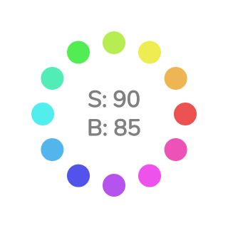

# p5.js の色指定

## RGB指定

数値で指定する場合、デフォルトでは 赤、緑、青 を指定する RGB モードとなっている

```javascript { linenos=false }
function setup() {
  createCanvas(800, 600);
  noStroke();

  background(255); // 引数が1つだとグレースケール。0 が黒で 255 が白
  
  background(0, 32); // 引数が2つだとグレースケール + α値（不透明度）
  
  fill(0, 128, 255); // 引数が3つだとRGB指定。赤、緑、青 の順
  circle(250, 300, 200);

  fill(0, 128, 255, 64); // 引数が4つだと RGB + α値（不透明度）
  circle(550, 300, 200);
}
```

※ どの値も範囲は 0～255 （`colorMode()` で変更可能）


## カラーコード形式

文字列で指定する方法。Web上のカラーパレットツールなどを利用するときに便利

**※ 値の先頭に** `#` **を付けることに注意**

```javascript { linenos=false }
function setup() {
  createCanvas(800, 600);
  noStroke();
  fill("#0080ff"); // 2桁ごとに 赤、緑、青（、α）の16進数（00～ff）
  circle(400, 300, 200);
}
```

- カラーモード（RGB/HSB）の影響は受けない
- 一応、さらに2桁付け足すことでα値も指定できる

### カラーパレットツール紹介

[Color Hunt](http://www.colorhunt.co/)  
4色のカラーパレットが大量に登録されている

[Adobe Color](https://color.adobe.com/)  
5色のうち1色について色相を変えると、他の色の色相も自動的にバランスを調整してくれる

[paletton](http://paletton.com/)  
Adobe Color と同じく、バランスを調整してくれる


## HSB指定

色相・彩度・明度 を指定する（色相とは、赤、黄、緑、青、紫……などの色味の違いのこと）

色の数値を自分で調整する場合は、こちらのほうが RGB よりも直感的

```javascript { linenos=false }
function setup() {
  createCanvas(800, 600);
  
  // HSBモード。色相の範囲を 0～360、彩度・明度・α値 の範囲を 0～100 に設定
  colorMode(HSB, 360, 100, 100, 100);
  
  noStroke();

  // 引数が1つだとグレースケール（明度を指定）。
  // 上記の colorMode によって、明度の範囲は 0～100 になっている
  background(100);
  
  fill(30, 100, 100); // 色相、彩度、明度 の順
  circle(250, 300, 200);

  fill(30, 100, 100, 64); // 4つ目の引数はα値（不透明度）
  circle(550, 300, 200);
}
```

### 色相について

色相の値の範囲が 0～360 とすると、  
以下のような図（色相環と言う）の中で角度（0°～360°）を指定する、と考えれば良い

目安としては 0 で赤、30 で橙、60 で黄色…… という具合


